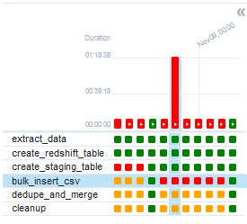

# What's this?
- Airflow exercises.

# Environment
- Ubuntu 22.04 Server, 5.15.0-124-generic
- Docker version 27.3.1, Compose v2

# Setup
- Run ./setup.sh

# Troubleshooting
- Punch your monitor.
- Constant webserver sync worker sigkill
    - Maybe try reducing worker numbers or using gevent worker.
    - 1. `docker network inspect bridge` and get the container subnet address.
    - 2. sudo ufw allow from [subnet_address] to any port 5432
    - If it still don't work, dunno what'll do.
- No such python package error:
    - Try installing it on the worker container as well as the scheduler container.
    - Or just add the package to the `_pip_additional_requirements` in the compose yaml.
- Don't want to use them fudgin S3 cuz S3 stands for 3 asses?
    - sql to csv to sftp >  to redshift dag
    - or store csv locally!
    - you can do this with two dags with a trigger
    
    - that's what you get for trying new things 😫
# Todos
- [ ] Add slack notifier