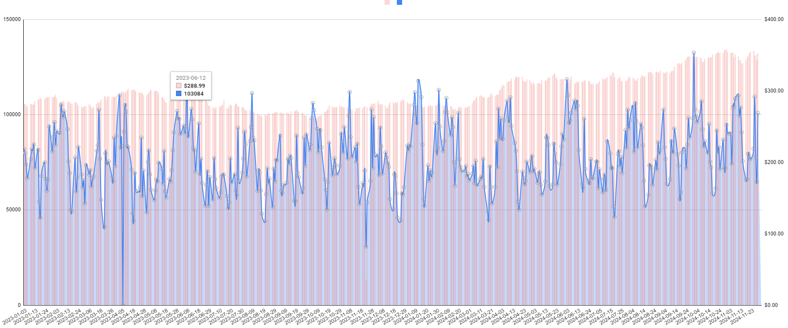

  
  
  
  

## 🥨 What This Is
- An Airflow *exercise*.
- It supposedly demonstrates DBT integration 🙄
- Demonstrates Google Sheets rendering
- And Slack notification

## ✨ What It Does

☝🏽 - Extracts, from an API, commodity prices 
🤘🻠- Crawls Reddit using YARS 
🤟 - Analyze sentiment using Vader analyzer 
✊🾠- Shape data with DBT 
✋🿠- Write to Google Sheet 

✔ Dose are all da DAGs dere are

  
CHARTs

  
TODOs

    
  - [x] Add slack notifier
  - [x] Visualize on Google Sheets

  - [x] DBT integration
  - [ ] Tidy up DAGs and Dockerfile for unused lines and packages
  - [ ] Constants refactoring
  - [ ] Try the S3 to Redshift thingy

## 🔱 The Gidup
**Environment** 
- Ubuntu 24.04 Server, 6.8.0-49-generic
- Docker version 27.3.1, Compose v2 

**Done & Learned**
- AIRFLOW: A 2.9.1 version Airflow docker-compose.yaml
- AIRFLOW: Custom Docker image for root access
- AIRFLOW: Tasks were defined inside 'with-dag' to avoid multiple dag definition execution
- AIRFLOW: XCOM is not very intuitive on escaping special characters. Must filter them out with regex first or opt to using the task decorator
- AIRFLOW: Tried out `TriggerDagRunOperator` for the 1st time
- AIRFLOW: Celery exc can't provide high availability unless paired with a message queue
- CRAWLING: `Proxybroker` was used at first to try rotating proxies to avoid ban but turned out to be unnecessary due to smaller search results
- REDSHIFT: Redshift enforces `varchar(256)`, no more
- REDSHIFT: `getdate()` is the server-side time. Use `current_timestamp`
- REDSHIFT: `serial` doesn't work. Use `identity(1,1)` instead
- DBT: Append-only strategy with implicit SCD(on the inference table), so no snapshot needed
- DBT: Seeds are for static lookups from csv etc... not a physical table
- JINJA: The template will render integers to blasted strings
- Google Sheet: Ahhhhhhhhhhhhh it sucks 

**Trouble & Strife** 
- Can't get rid of the webserver worker sigkill(mild severity)
- How is rate limit on crawling handled in read business? Do they use proxy rotation in practice?
- Why can't I get any proxy in KR

## 🏃🏿‍♂️ Run
- Run ./setup.sh
- `docker compose up`
- Setup your connections and variables(slack webhook)

## 🍕 References

1. The crawler "<a href="https://github.com/datavorous/yars" target="_blank">YARS(Yet Another Reddit Scraper)</a>." <i>Github</i>, MIT License.

2. The model "<a href="https://github.com/jane/data-visualizer" target="_blank">VADER-Sentiment-Analysis</a>." <i>GitHub</i>, MIT License.

3. OpenWeatherMap. "<a href="https://openweathermap.org/api" target="_blank">Weather API</a>." Version 3.0. [Accessed: 2024-11-25].

